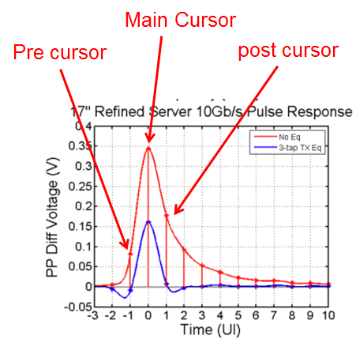
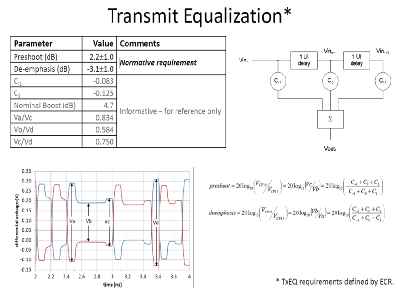

# 均衡器

## 预加重(Pre-emphasis)

几个概念先了解一下

### Pre-emphasis vs De-emphasis

在FM通信系统中，Pre-emphasis表示提高高频分量的增益， De-emphasis系统中表示
衰减高频分量增益。如下图，可以分别看成是高通和低通滤波器，而且是相互抵消的关系[^silist]。

但在高速数字通信系统中，二者没有本质的区别，唯一的区别是系数的绝对值之和
是否比1大，比1大就是Pre-emphasis，意味着peak-peak swing比原先的波形大，
比1小就是De-emphasis意味着peak-peak swing比原先的波形小。

下图假定数据速率为5Gbps,其Nyquist频率为2.5GHz. 2者的曲线没有本质区别，
之后一个垂直方向的偏差。

* 红色的曲线系数为[1.5,-0.5],其DC增益为0dB，但是Nyquist频率处增益为6dB
* 蓝色色的曲线系数为[0.75,-0.25],其DC增益为-6dB，但是Nyquist频率处增益为0dB

其Python源代码如下：




### Pre-emphasis几种不同的名称


Pre-emphasis == FFE(Feed forward equalizer) == FIR filter == Convolve


这几个概念完全等同，Pre-emphasis本质就是FIR滤波，也称为FFE前方反馈滤波器，
在DSP算法中，可以用卷积实现。


Pre-emphasis taps = coefficient


这个容易理解，tap就是FIR滤波器的系数。

Pre cursor 和 post cursor的区别，是tap相对于main tap的位置。

以2个tap为例，比如系数为[-0.25,0.75]，表示1个tap的pre cursor，值为-0.25。
系数为[0.75，-0.25]，表示1个tap的post cursor，值为-0.25。

以三个tap的系数[-0.131,0.595,-0.274]， 最大的0.595为main tap, -0.131为pre cursor
-0.274为post cursor

下图表示出了channel response中cursor的位置

### dB和tap之间的关系

这个也是很容易混淆的概念，很多业界标准如PCI-E GEN2中规定了-3.5dB,6dB 均衡器。
下图是USB3.0标准中关于EQ系数和dB之间的关系。

从图中不难看出:

1. de-emphasis是受post cursor控制
2. pre-shoot 是受pre cursor控制
3. 需要长 **0** 或者 长 **1** pattern才能看出de-emphasis/pre-shoot效应

 

下面可以做一个简单的计算，如果tap系数为[0.75,-0.25],这表明$C_{-1}=0$,
$C_{0}=0.75$,$C_{1}=-0.25$ 带入公式得到:

$$
deemphasis = 20log_{10}\left(\frac{C_{-1}+C_0+C_1}{C_{-1}+C_0-C_1}\right) = 20log_{10}\left(\frac{0+0.75-0.25}{0+0.75-0.25}\right) =-6dB
$$

下面为pre-emphasis代码Python实现的方法演示，其中用到了卷积来实现。




下图是代码输出的图片

![pre-emphasis demo][preemphasis]

[preemphasis]: ../images/preemphasis.png "pre-emphasis demo"

[^silist]: https://www.freelists.org/post/si-list/Whats-different-between-Preemphasis-and-Deemphasis

